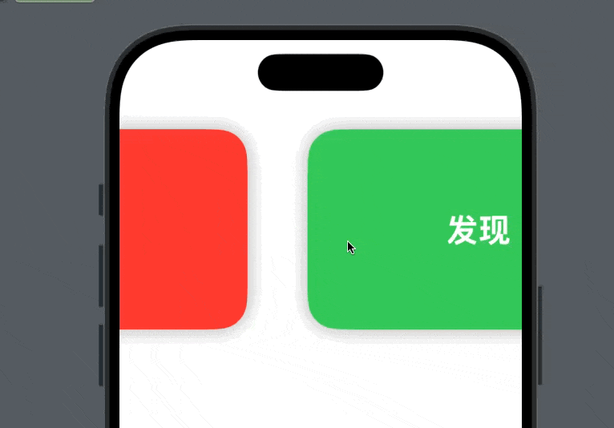

# 📦 AutoPagingTabView

一个 SwiftUI 自动翻页的轮播图组件，支持自定义内容、翻页间隔、圆角、阴影。



## ✅ 功能特色

- 自动翻页（定时器控制）
- 自定义页面内容（使用 ViewBuilder）
- 圆角、阴影、内边距
- 完全 SwiftUI，轻量易集成

## 🚀 安装方式

在你的项目 `Package.swift` 中加入：


然后在你需要的文件中导入：

```swift
import AutoPagingTabView
```

## 🧪 使用示例

```swift
import SwiftUI
import AutoPagingTabView // 如果你是通过 SPM 引入的包

struct Banner: Identifiable {
    let id = UUID()
    let title: String
    let color: Color
}

struct ExampleAutoPagingView: View {
    let banners = [
        Banner(title: "欢迎", color: .red),
        Banner(title: "发现", color: .green),
        Banner(title: "享受", color: .blue),
        Banner(title: "世界", color: .orange)
    ]
    
    var body: some View {
        VStack {
            AutoPagingTabView(
                data: banners,
                interval: 2,
                cornerRadius: 30,
                outerPadding: 30,
                shadowRadius: 10
            ) { banner in
                ZStack {
                    banner.color
                    Text(banner.title)
                        .font(.largeTitle.bold())
                        .foregroundColor(.white)
                }
                .frame(height: 200)
            }
            
            Spacer()
        }
       // .padding(.top, 40)
      //  .background(Color(UIColor.systemGroupedBackground))
        .ignoresSafeArea()
    }
}

#Preview {
    ExampleAutoPagingView()
}
```

## 🧩 自定义参数

| 参数                | 类型                | 默认值     | 说明                         |
|---------------------|---------------------|------------|------------------------------|
| `interval`          | `TimeInterval`      | `3`        | 自动翻页间隔（秒）           |
| `cornerRadius`      | `CGFloat`           | `12`       | 内容卡片的圆角                |
| `horizontalPadding` | `CGFloat`           | `16`       | 卡片左右间距                  |
| `shadowRadius`      | `CGFloat`           | `4`        | 阴影模糊半径                  |