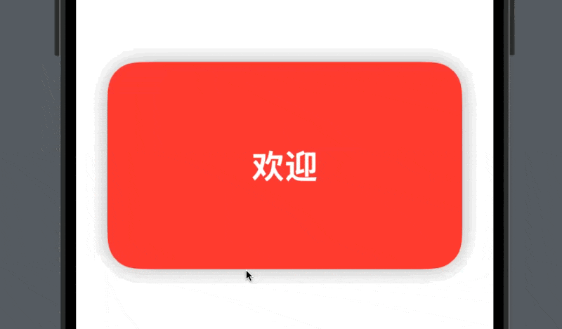

# 📦 AutoPagingTabView

一个 SwiftUI 自动翻页的轮播图组件，支持自定义内容、翻页间隔、圆角、阴影。



## ✅ 功能特色

- 自动翻页（定时器控制）
- 自定义页面内容（使用 ViewBuilder）
- 圆角、阴影、内边距
- 完全 SwiftUI，轻量易集成

## 🚀 安装方式

在你的项目 `Package.swift` 中加入：


## 🧪 使用示例

```swift
import SwiftUI
import AutoPagingTabView

struct ExampleAutoPagingView: View {
    var body: some View {
        VStack {ß
            AutoPagingTabView(
                titles: ["欢迎", "发现", "享受", "世界"],
                colors: [.red, .green, .blue, .orange],
                interval: 2,
                cornerRadius: 30,
                outerPadding: 30,
                shadowRadius: 10
            )
        }
    }
}

#Preview {
    ExampleAutoPagingView()
}
```

## 🧩 自定义参数

| 参数                | 类型                | 默认值     | 说明                         |
|---------------------|---------------------|------------|------------------------------|
| `interval`          | `TimeInterval`      | `3`        | 自动翻页间隔（秒）           |
| `cornerRadius`      | `CGFloat`           | `12`       | 内容卡片的圆角                |
| `outerPadding`      | `CGFloat`           | `16`       | 卡片左右间距                  |
| `shadowRadius`      | `CGFloat`           | `4`        | 阴影模糊半径                  |
